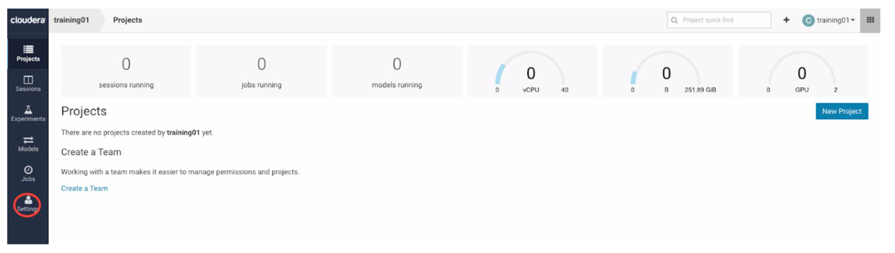
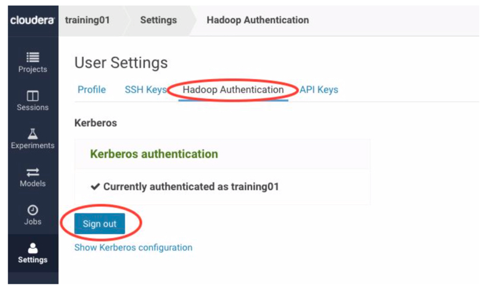
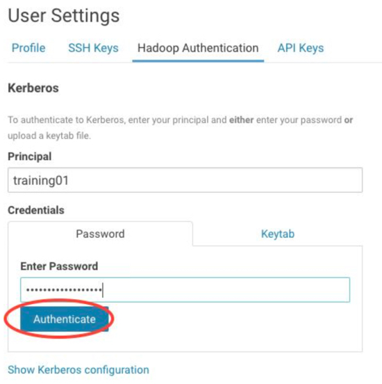
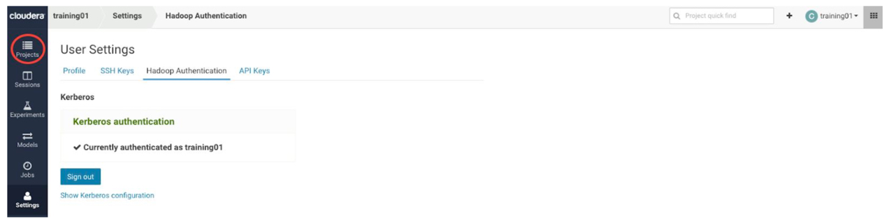

## Lab 1  : Login to Cloudera Data Science Workbench Environment

In this lab, you will learn how to: 

In this lab you’ll learn how to:

* Login to a Cloudera Data Science Workbench instance
* Set your Hadoop Authentication
* Navigate the Cloudera Data Science Workbench application

First thing you need to do is register onto Cloudera Data Science Workbench URL. This will be provided by your instuctor at the start of the session.  ​

Your instructor will also provide the login credentials for the workshop. 

Login with the provided credentials, like user trainingxx and a password.

When you are logged in, you need to specify the credentials to connect to the Cloudera cluster. Click on the ‘Settings’ button, and then the “Hadoop Authentication” link.




If you see that the Hadoop Authentication is already setup, then nothing additional is required, if not then follow the options below to set it up.

The Principal is ```cdsw@HADOOPSECURITY.LOCAL``` and password is ```Cloudera1```




Once done successfully, navigate back to the project by clicking on the 'Projects' button.

End of Lab 1.
---


