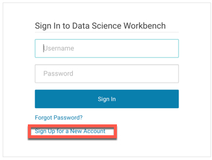
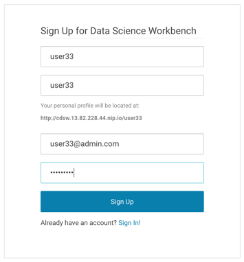
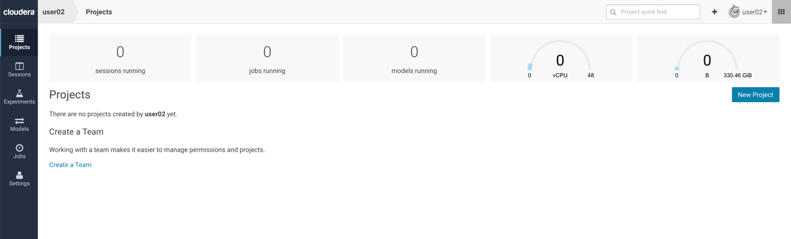

## Lab 1  : Register to Cloudera Data Science Workbench Environment

In this lab you’ll learn how to:

* Login to a Cloudera Data Science Workbench instance
* Set your Hadoop Authentication
* Navigate the Cloudera Data Science Workbench application

First thing you need to do is register onto Cloudera Data Science Workbench URL. This will be provided by your instuctor at the start of the session.  ​

Click the 'Sign Up for a New Account' option.



Your instructor will also provide the login credentials (username) for the workshop. 

**Please note that other usernames will not work correctly. Please make sure your username is exactly user where xx is a number given to you by your lab instructor.**

Register your details in the screen. Use a simple password like ```Cloudera1```.



Afler clicking sign up, it will automatically login with the provided credentials and bring you to the home screen. 

**Question**: How will this help your IT group manage the explosive growth of Data Scientists?

**Question**: How do you sign out of your account? - Do it now, then sign back in. 

**Question**: Does your laptop have enough RAM to run different types and loads for Data Science jobs you would like to utilize? Look at the main Dashboard. How much RAM and vCPUs are setup in our lab environment for the group to use?


End of Lab 1. 

----

[Back to Main Labs](../README.MD)


