## Lab 2  : Creating a new project

### Project Setup
---

Before we start with a new project, let's look at the options available on the left ribbon. 

* Projects - These would be all the projects that you have access to
* Sessions - Shows all the current sessions that are running
* Experiments - Batch experiments that you have setup
* Models - Build, Deploy and Manage models as REST APIs to serve predictions
* Jobs - Run and schedule jobs and add dependencies
* Settings - User, Hadoop Authentication, SSH Keys and Permissions

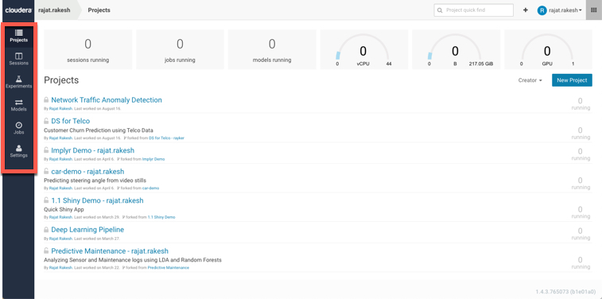

In the top right corner, you have the search option for quickly searching through projects the ```+``` Option for creating a new project and a new team. 

Let's create a new Project:

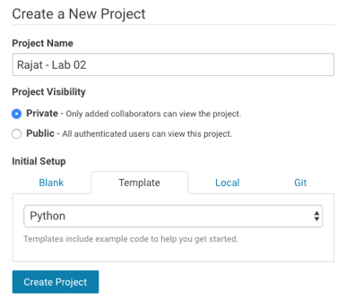

There are 4 options available for creating a project:

* Blank - Create a blank placeholder project
* Template (Default) - Creates a sample project (R, Python, Scala)
* Local - Lets you upload your project folder and zip
* Git - You can import a git project through a URL

Let's create 2 Projects:

Select Template and Python Template from the drop down. Give this project the name ```Your User ID - Lab 02```. For e.g. if your userid is CDSW01 then your Project name will be ```CDSW01 - Lab 02```

And click 'Create Project'.

You will see a sample project created with some data and python scripts already inside. 

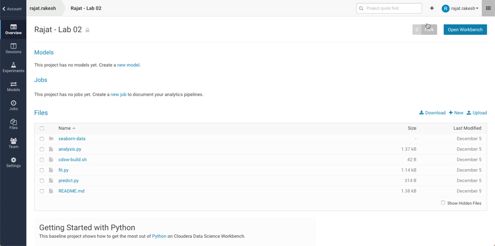

Navigate back to the main Project screen by click your userid at the top left corner of the screen. (You can also do this by clicking the ```+``` as well (top right)

Click New Project. 

This time, let's create a new project using the Git option. Give this Project the name - ```Userid - Lab 02 - Demo```

The url for Git is ```https://github.com/rajatrakesh/cdsw-demo-short.git```. Copy and paste this in the Url. 

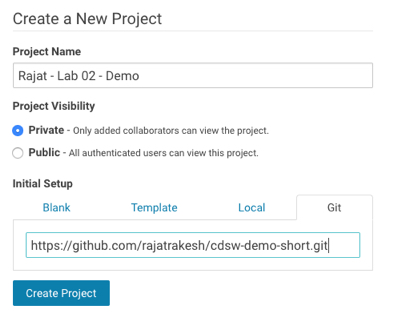

Once imported, the project structure would look as follows.

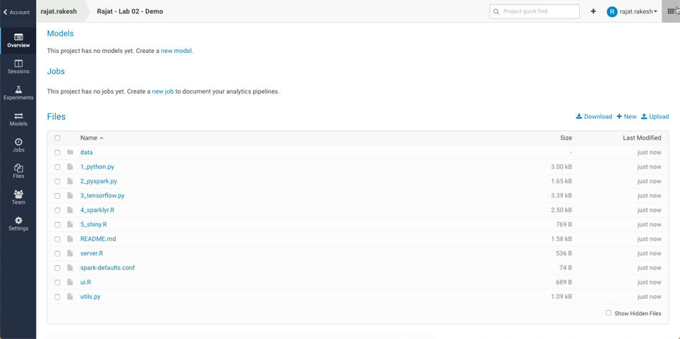

### Collaboration
---

On the left ribbon, you will see another option for 'Team' when you are in the Project view. Click on 'Team'. This will bring up the collaboration screen. 

Currently you are the only member assigned to this project and since you created it hence you are assigned as 'Admin'. 

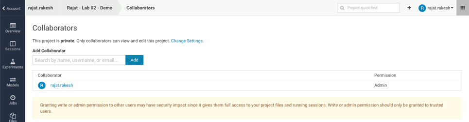

Add a few collaborators (atleast 1) to your Project. You can add a fellow participant in this workshop, or you can add in admin. Typing in the collaborator box will show you the users. 

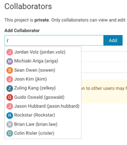

Select a user and click add. They will be added to your Project and will have visibility on the contents of this project as well. 

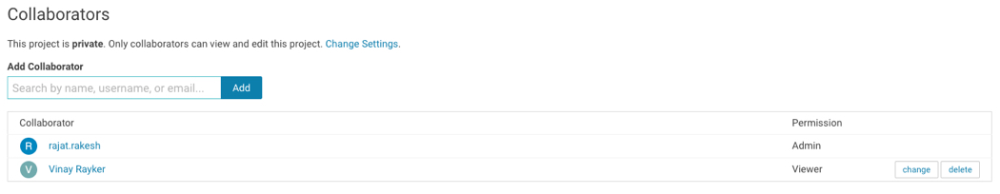

### Project Settings
---

Click on the 'Settings' option on the left ribbon. This will bring up the Settings for this 'Project'.

First screen shows you the visibility of this Project, Description and the Name. 

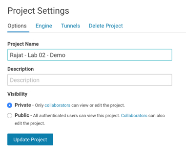

Clicking on 'Engine' brings the following screen. Every project is assigned an 'Engine' image. You can choose and change it to a different image available in your CDSW installation. 

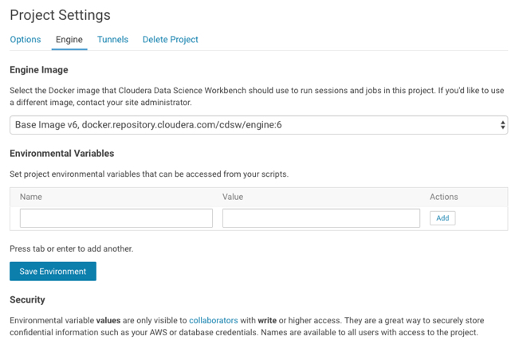

**It is possible that in your instance, only ONE image might be visible as other have not be set up.** You can also configure any 'Environment Variables' here that would have a Project scope. 

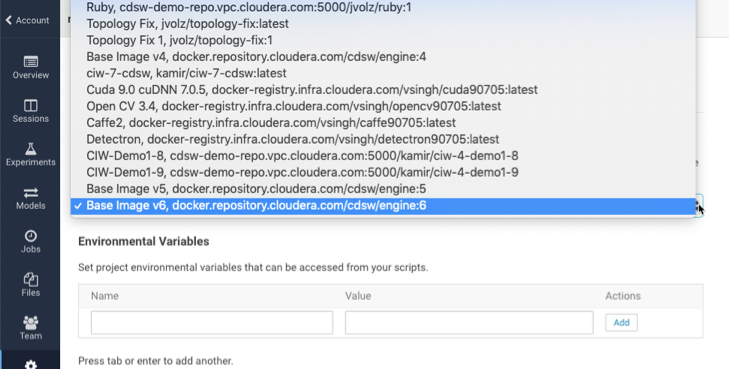

Ignore the 'Tunnels' and 'Delete' option for now. 

### End of Lab 2
---


