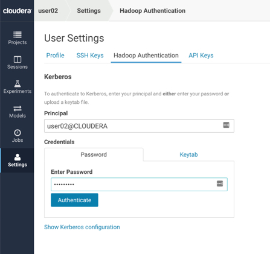
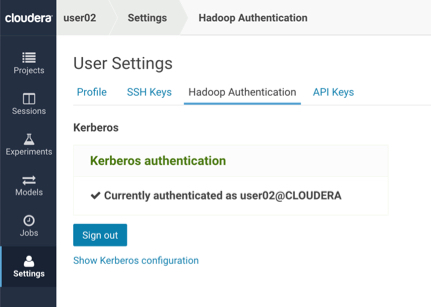

# Lab 2 : Hadoop Authentication

Only do this lab if you know your cluster is kerberized AND you know your kerberos credentials.At Cloudera we believe all clusters should be secured with Kerberos. However configuring a regular Jupyter notebook to gain access to a secure cluster is very difficult. Here we show you how easy it is with CDSW:

Navigate to **Settings -> Hadoop Authentication**

The Principal and password that you would need to use for this lab would be as follows:

	* If you are using the labs setup and provided by Cloudera, then use `userxx@CLOUDERA` as your Principal and `Cloudera1` as your password. If you are using your own environment then this would need to be the kerberos principal accounts setup in your hadoop cluster. 
	* Click Authenticate

And that’s it! - you’re now ready to work on a secured cluster.
In a normal production setting each of you would have separate authentication credentials as we are doing.  It’s also possible to have users access Hadoop with the same credentials but that’s not a best practice and often violates company  and compliance policies.

**Question**: Will IT finally allow your Data Scientists access to the secured data in Hadoop?
**Question**: How do you think you might use the public SSH key that’s made available in this Settings section?
**Question**: If an alternate solution hardcoded Hadoop credentials in the application code, how big of a problem do you think that would be to maintain and stay compliant within your company and our at your customer?

End of Lab 2

----

[Back to Main](https://github.com/rajatrakesh/cdswlabs)