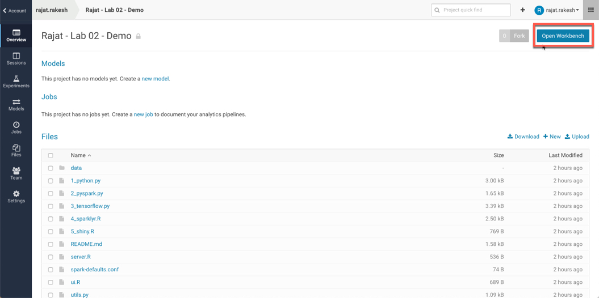
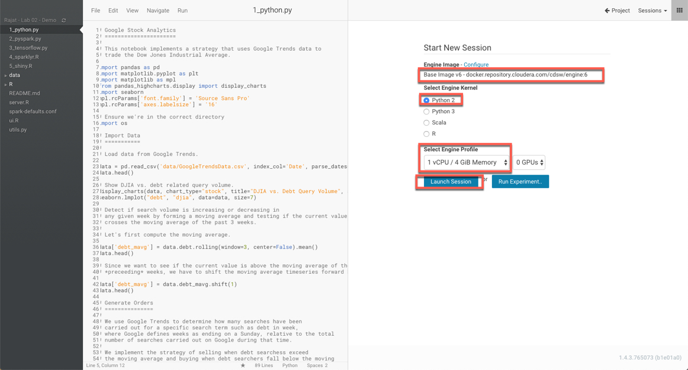
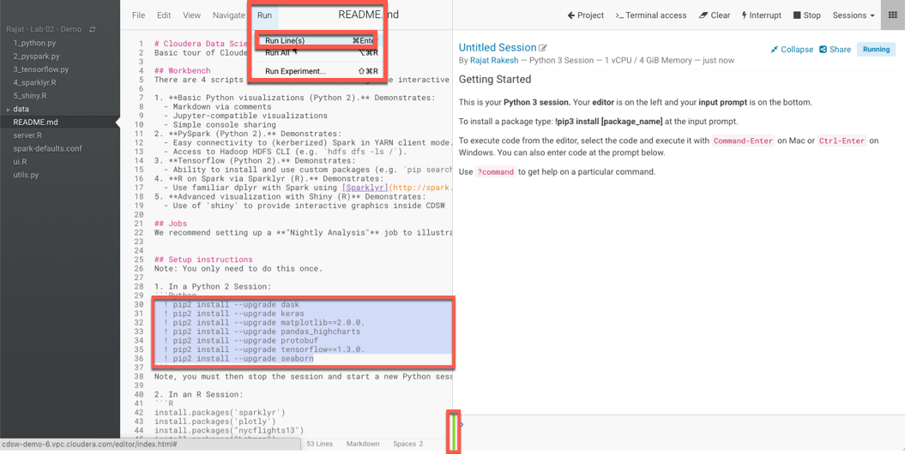
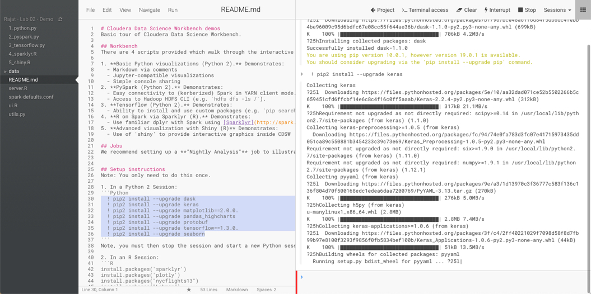
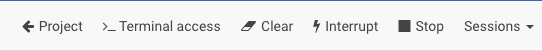
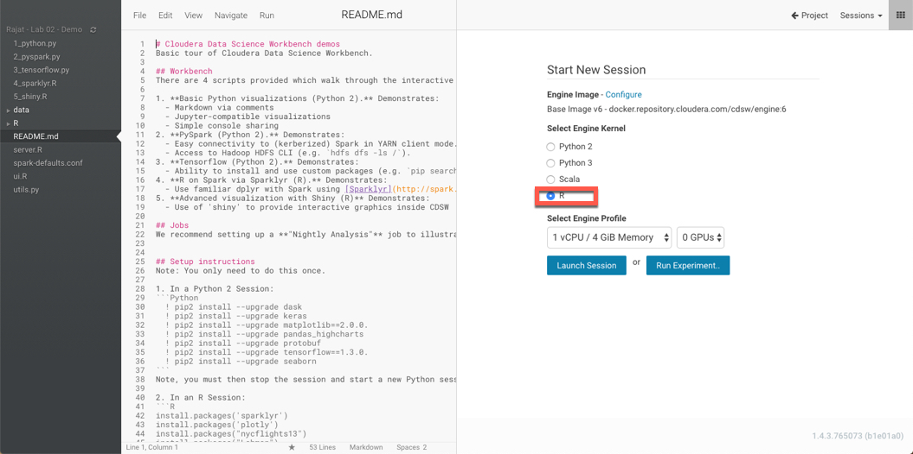
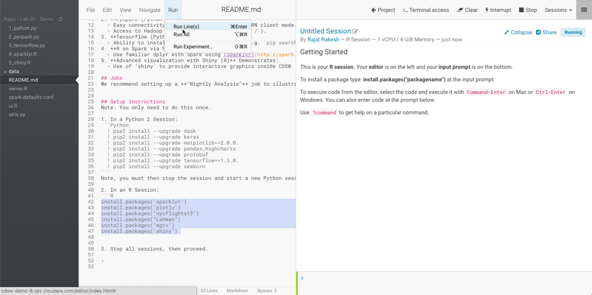
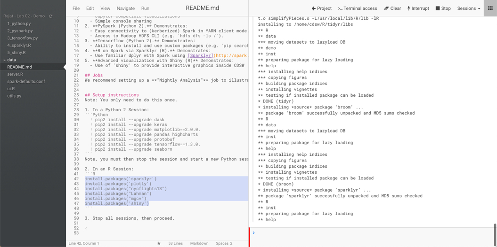

## Lab 3: Launching your first Workbench Session

Let's start from the Project screen. Open the 'Lab 02 - Demo' project that you created in the previous lab. 



Click the 'Open Workbench' button the right top corner of the screen. It will bring up this window. Here we will choose the shape of the container in which our project will be run. 
 
You will see the base image (v5/v6) pre-selected for your project. As shown in the previous lab, this is assigned at the Project settings. 

Then select the 'Engine Kernel'. Since we will be running Python code first in this workshop, let's choose 'Python 3'. Lastly, you can choose the shape of the container (depending on the access given to you by CDSW Admin). In our case, we will choose ```1 vCPU / 4 GiB Memory```. During the course of this workshop, unless otherwise specified, this will be our default 'Engine Profile'.



Once the screen launches, on the left side of the screen are the contents of the project. You can refresh by clicking the '()' symbol on the left. To open a particular file, simply click on it. This will load the contents of the file in the editor window. 

While the container loads, you will notice a red color vertical line, in the bottom middle of the screen. This shows that the container is being started. Once the session is loaded, this will become green. You will also notice in the right window, there are two tiles. The top one is an output tile and the bottom one (which should have turned green) is a shell input window. 

Now look at lines 30-36 of README.md. What are these ?

For people who have worked with Python before, it should be quite obvious. This is an execution of pip (a python package manager), which will tell the system to install or upgrade the listed python packages. Certain base packages are already installed in our engine image, but we have the option of installing additional packages. This step is to be done ONCE. Once downloaded and installed, these would then be available at a Project level, even if you stop the session and start it again. This feature given the flexibility to then have various versions of packages being made available to different projects. 

Now, let's install the libraries that we will need for our project. Simply select the highlighted lines, and click 'Run lines' in the 'Run' Menu. This will start downloading and installing these packages. 



You will notice packages being downloaded and installed. The green status bar turns 'Red' while any execution is pending on this instance. After completing, this becomes 'Green' again.



You will also notice, a few additional options in the Menu bar at the top. These option are:

* _Terminal Access : Gives your terminal access (command line) to the session
* Clear : Clears the output in the Output tile
* Interrrupt: Interrupts your session
* Stop : Stops the current session

Since we are done with the installation of the packages, let's 'Stop' our session. This will bring us back to your 'Launch Session' screen. 



Let's start an 'R' session this time as we need to install a few 'R' libraries as well. Launch an 'R' session with the same 'Engine Profile' as before (1vCPU, 4 Gib RAM). Change the 'Engine Kernel' to 'R' and click Launch.



Once the session starts, this time we will execute lines 43 to 47 which will download and install the required libraries for the 'R'. Select the lines, and as before click 'Run lines'. 



You will notice the packages being downloaded and installed. This process may take slightly longer as code is being downloaded, compiled and installed into your project's workbench. 

As mentioned above, note that this workbench is independent of any other project’s workbench. You want to try out different and conflicting libraries? Go for it. 

Just start another project, open the workbench, pick the libraries you want, install them and off you go. Just like on your laptop, but this is managed, secure, stable, won’t get stolen or lost if you move between laptops and is always available and easily shared!

All of this isolation is achieved by mounting filesystems (one or more per project) into docker containers (one per engine). The details don’t matter at this stage, except to note that now you can really try out lots of different and conflicting permutations without having to go down the complex path of virtual environments etc. It’s all been done for you! 



Once all pacakges are installed and the line turns 'Green' again. Stop the Session. 

### End of Lab 03
---