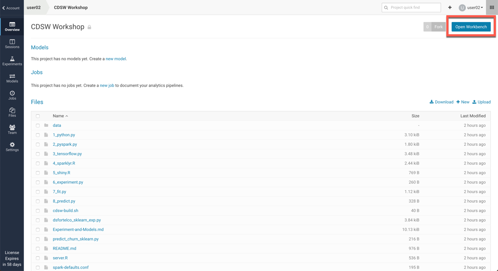
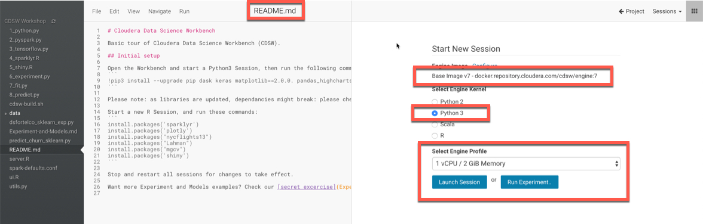
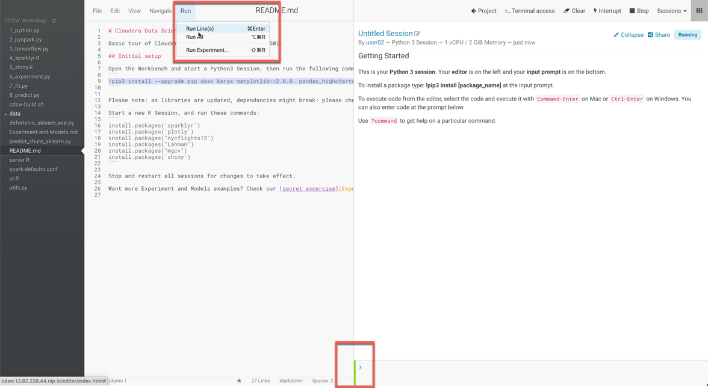
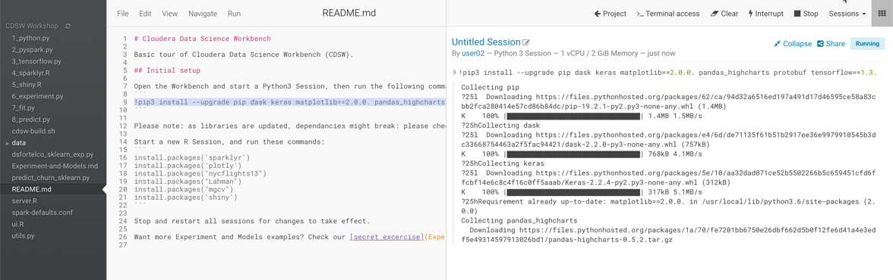
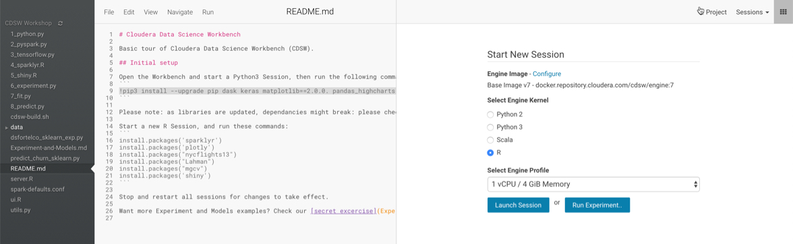
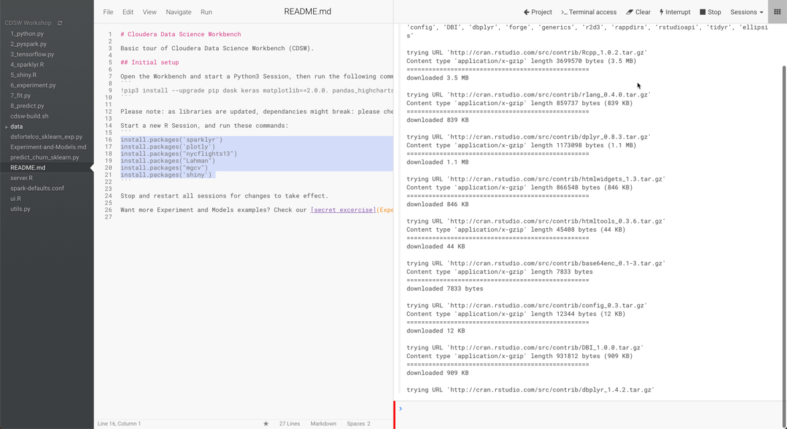

## Lab 3: Creating your first CDSW Project

### Project Setup

------

Before we start with a new project, let's look at the options available on the left ribbon. 

- Projects - These would be all the projects that you have access to
- Sessions - Shows all the current sessions that are running
- Experiments - Batch experiments that you have setup
- Models - Build, Deploy and Manage models as REST APIs to serve predictions
- Jobs - Run and schedule jobs and add dependencies
- Settings - User, Hadoop Authentication, SSH Keys and Permissions


In the top right corner, you have the search option for quickly searching through projects the ```+``` Option for creating a new project and a new team. 

Let's create a new Project. Click 'New Project' in the right top corner.

There are 4 options available for creating a project:

- Blank - Create a blank placeholder project
- Template (Default) - Creates a sample project (R, Python, Scala)
- Local - Lets you upload your project folder and zip
- Git - You can import a git project through a URL

Let's create 2 Projects:

Select Template and Python Template from the drop down. Give this project the name ```Your User ID - Lab 02```. For e.g. if your userid is CDSW01 then your Project name will be ```CDSW01 - Lab 02```

Let's create 2 Projects:

Select Template and Python Template from the drop down. Give this project the name ```Your User ID - Lab 02```. For e.g. if your userid is user01 then your Project name will be ```user01 - CDSW Lab```

And click 'Create Project'.


You will see a sample project created with some data and python scripts already inside. 


Navigate back to the main Project screen by click your userid at the top left corner of the screen. (You can also do this by clicking the ```+``` as well (top right)

Let's create another Project. Click New Project. 

This time, let's create a new project using the Git option. Give this Project the name - ```CDSW Workshop```

The url for Git is ```https://github.com/rajatrakesh/cdsw-demo```. Copy and paste this in the Url. 


Once imported, the project structure would look as follows.


### Collaboration

------

On the left ribbon, you will see another option for 'Team' when you are in the Project view. Click on 'Team'. This will bring up the collaboration screen. 

Currently you are the only member assigned to this project and since you created it hence you are assigned as 'Admin'. 


Add a few collaborators (atleast 1) to your Project. You can add a fellow participant in this workshop, or you can add in admin. Typing in the collaborator box will show you the users. 


Select a user and click add. They will be added to your Project and will have visibility on the contents of this project as well. 


### Project Setup

------

Click on the 'Settings' option on the left ribbon. This will bring up the Settings for this 'Project'.

First screen shows you the visibility of this Project, Description and the Name. 


Clicking on 'Engine' brings the following screen. Every project is assigned an 'Engine' image. You can choose and change it to a different image available in your CDSW installation. 


**It is possible that in your instance, only ONE image might be visible as other have not be set up. In production environments, you can setup multiple images that users can choose for execution that have packages and components pre-installed. **You can also configure any 'Environment Variables' here that would have a Project scope. 


Ignore the 'Tunnels' and 'Delete' option for now. 

### Setting up your Project for the First run

------

Let's start from the Project screen. Open the 'CDSW Workshop' project that you created in the previous step. 



Click the 'Open Workbench' button the right top corner of the screen. It will bring up this window. Here we will choose the shape of the container in which our project will be run. 

You will see the base image v7 pre-selected for your project. As shown in the previous lab, this is assigned at the Project settings. 


Then select the 'Engine Kernel'. Since we will be running Python code first in this workshop, let's choose 'Python 3'. Lastly, you can choose the shape of the container (depending on the access given to you by CDSW Admin). In our case, we will choose ```1 vCPU / 2 GiB Memory```. During the course of this workshop, unless otherwise specified, this will be our default 'Engine Profile'.



Once the screen launches, on the left side of the screen are the contents of the project. You can refresh by clicking the '()' symbol on the left. To open a particular file, simply click on it. This will load the contents of the file in the editor window. 

While the container loads, you will notice a red color vertical line, in the bottom middle of the screen. This shows that the container is being started. Once the session is loaded, this will become green. You will also notice in the right window, there are two tiles. The top one is an output tile and the bottom one (which should have turned green) is a shell input window. 

Now look at lines 9, 16-21 of README.md. What are these ?

For people who have worked with Python before, it should be quite obvious. This is an execution of pip (a python package manager), which will tell the system to install or upgrade the listed python packages. Certain base packages are already installed in our engine image, but we have the option of installing additional packages. This step is to be done ONCE. Once downloaded and installed, these would then be available at a Project level, even if you stop the session and start it again. This feature given the flexibility to then have various versions of packages being made available to different projects. 

Now, let's install the libraries that we will need for our project. Simply select the highlighted lines, and click 'Run lines' in the 'Run' Menu. This will start downloading and installing these packages. 



You will notice packages being downloaded and installed. The green status bar turns 'Red' while any execution is pending on this instance. After completing, this becomes 'Green' again.



You will also notice, a few additional options in the Menu bar at the top. These option are:

* _Terminal Access : Gives your terminal access (command line) to the session
* Clear : Clears the output in the Output tile
* Interrrupt: Interrupts your session
* Stop : Stops the current session

Since we are done with the installation of the packages, let's 'Stop' our session. This will bring us back to your 'Launch Session' screen. 


Let's start an 'R' session this time as we need to install a few 'R' libraries as well. Launch an 'R' session with the 'Engine Profile'  (1vCPU, 4 Gib RAM). Change the 'Engine Kernel' to 'R' and click Launch.



Once the session starts, this time we will execute lines 16 to 21 which will download and install the required libraries for the 'R'. Select the lines, and as before click 'Run lines'. 



You will notice the packages being downloaded and installed. This process may take slightly longer as code is being downloaded, compiled and installed into your project's workbench. 

As mentioned above, note that this workbench is independent of any other project’s workbench. You want to try out different and conflicting libraries? Go for it. 

Just start another project, open the workbench, pick the libraries you want, install them and off you go. Just like on your laptop, but this is managed, secure, stable, won’t get stolen or lost if you move between laptops and is always available and easily shared!

All of this isolation is achieved by mounting filesystems (one or more per project) into docker containers (one per engine). The details don’t matter at this stage, except to note that now you can really try out lots of different and conflicting permutations without having to go down the complex path of virtual environments etc. It’s all been done for you! 


Once all pacakges are installed and the line turns 'Green' again. Stop the Session. 

**Question**: How many beers will the IT guys buy you when they realize that you now have a secure, auditable and managed system where they don’t have to pick and choose the libraries that you install? 

### End of Lab 03
---