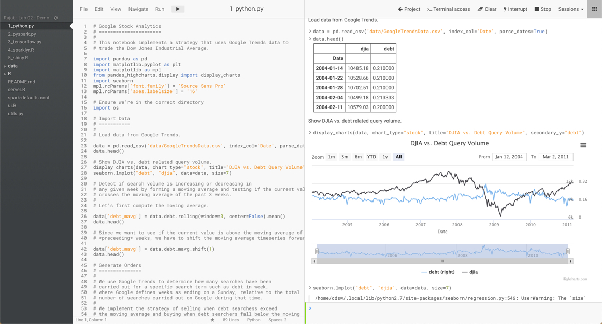
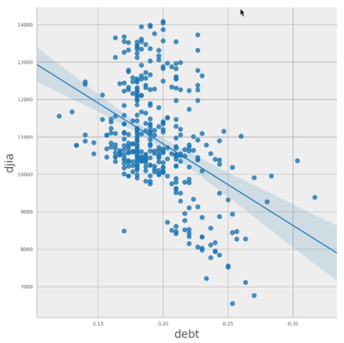
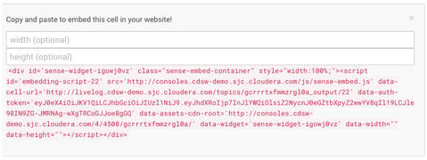
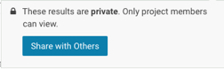
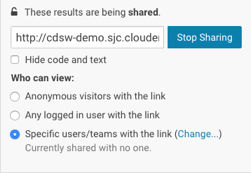
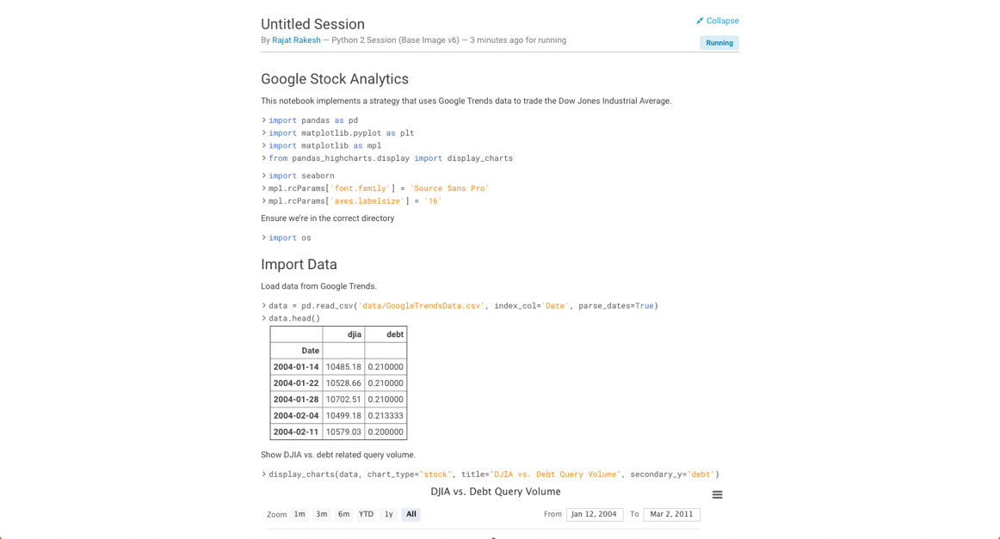

## Lab 4: Visualization & Sharing

Check that you have NO sessions running - if any sessions are running then stop them now. You’ve setup your environment and those sessions can be safely disposed of.

Data Science is often about visualizing ideas, and then sharing them to persuade others to take action. CDSW lets you use the visualization tools you’d use naturally, and adds a neat twist to the whole idea of sharing. 

Let’s get started:

1. Start up a new Python 2 session (1vCPU, 4GiB) in the same manner you did before.
2. Select 1_python.py in the file browser
3. Run the entire file (multiple ways of doing that - try to figure out more than one way. It should be
pretty obvious!).
4. You should end up with some nice graphs in the output window:

5. You can see that CDSW is very similar to a notebook, supporting the same visualization tools. However, unlike a notebook, it doesn’t use cells: instead it uses markup in the source file, and an output window. Furthermore, that window has some interesting properties ...
6. Scroll up to find this diagram:

7. On the left is a little chain link button: 
8. Click on it and you’ll see beneath the chart some html that can be used to embed that chart into a website:

9. Scroll to the top of the window and you’ll see this on the far right (the exact layout depends upon the real estate available – you might have to expand your browser window to see the following links and they might be laid out vertically or horizontally):

10. Hit the ‘collapse’ link and see the difference in the output window.
11. Question: What difference did you see? How might this be used? Is it useful?
12. Notebooks have great output, but how do you share what they show you? CDSW solves this by simply providing a link to the output that you can send to anyone and they can see the output. Try it:
13. Select the ‘Share’ link:

14. And then ‘Share with Others’ (your URL will be similar, but different from this one):

15. Cut and paste that link and put it into some other browser (best to be a completely different browser than the one you’re logged in with, but not that important)
16. You should see that you have access to almost the same output window (this new one doesn’t have this share link!)

So we’ve demonstrated how CDSW is like a notebook, but is perhaps more powerful, and has great sharing capability. 

### End of Lab 04
---