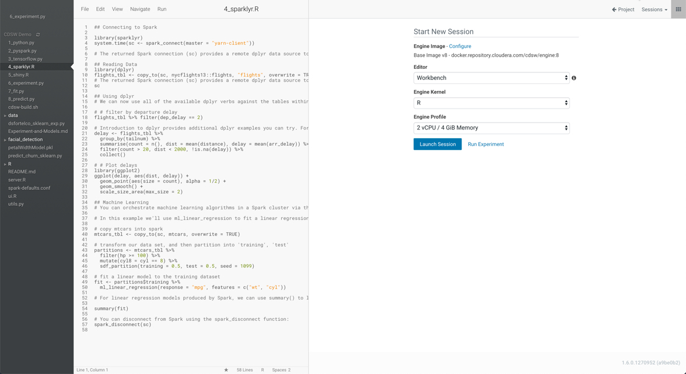

## Lab 6: R - SparklyR, Shiny

### SparklyR

We’ve focused on python integration, but just to show we can do similar things with R, let’s take a look at the R programs and execute them.  Let’s start with connecting to and running Spark from an R session.

 Start up an R session (2vCPU, 4GiB engine).

- Switch to the **R Session**.
- Select (and run) **4_sparklyr.R**
- Can you figure out some of the things it’s doing? If you know R, and if you know sparklyr, then you can get detailed; if you don’t know R then simply ‘collapse’ the output and see if you can make sense of the analysis without looking at any code … hopefully you can!

###Shiny

R has a great interactive experience using the shiny package. In this lab we’ll create an interactive histogram a nd you can work with it to find out the frequency distribution of the period between Yellowstone Geyser eruptions!

Run the **5_shiny.R** application

 This will start up a shiny server in the local context (line 16), and connect it to the server/ui code (in server.R and ui.R, respectively).

 Your users are then presented with a nice little application where they can experiment with changing some of the parameters and graphing features of R’s base graphics histogram plot!

Try generating a share link and opening up the share in another browser window - amazingly enough each browser share is independent, allowing your users to share the same underlying experience, but with their individual data inputs!

**STOP all your R Sessions now - this will help free up resources for everyone**

 **Question**: Is this kind of interactivity with data likely to change the way your business users understand and appreciate the work of the Data Scientists?

### End of Lab 6

------

[Back to Main](https://github.com/rajatrakesh/cdswlabs)