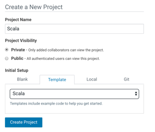

## Lab 7 : Scala

In this lab we show how you can use the ‘Template’ mechanism to get started with a simple Scala example:

- Navigate to the project space by selecting “project”:
- Create a new project by hitting the ‘+’ button on the top right and selecting ‘create project’:
- In the Create new Project window that comes up provide a name for your new project (‘Scala’, for
  example), and then choose the Scala template.

- Create the project. You’ll see the File Browser view onto the project.
- Hit ‘**Open Workbench**’ in the top right and let’s go run some Scala code:
- Start a **Scala** session
- The Scala example project includes its own data set that needs to be moved into HDFS, since that is where the scala code expects to find it. Open a Terminal by clicking on the **>_Terminal access** button and execute the following shell commands to do this. Note how you have ready access to your own project’s data (purely local to you) and the secure (and massive) HDFS cluster.
- `$ hdfs dfs -put data      /tmp/datauserXX`   (replace XX with      your user number)
- Execute one or more of the various scala files in the Workbench

**Question:** How will you use templates when demonstrating CDSW to your friends and colleagues?

STOP your Scala session now

### End of Lab 7

------

[Back to Main](https://github.com/rajatrakesh/cdswlabs)