## Lab 9 : Working with Models

Starting with version 1.4, Cloudera Data Science Workbench allows data scientists to build, deploy, and manage models as REST APIs to serve predictions.

**Challenge**

Data scientists often develop models using a variety of Python/R open source packages. The challenge lies in actually exposing those models to stakeholders who can test the model. In most organizations, the model deployment process will require assistance from a separate DevOps team who likely have their own policies about deploying new code.

 For example, a model that has been developed in Python by data scientists might be rebuilt in another language by the devops team before it is actually deployed. This process can be slow and error-prone. It can take months to deploy new models, if at all. This also introduces compliance risks when you take into account the fact that the new re-developed model might not be even be an accurate reproduction of the original model.

 Once a model has been deployed, you then need to ensure that the devops team has a way to rollback the model to a previous version if needed. This means the data science team also needs a reliable way to retain history of the models they build and ensure that they can rebuild a specific version if needed. At any time, data scientists (or any other stakeholders) must have a way to accurately identify which version of a model is/was deployed.

 **Solution**

Starting with version 1.4, Cloudera Data Science Workbench allows data scientists to build and deploy their own models as REST APIs. Data scientists can now select a Python or R function within a project file, and Cloudera Data Science Workbench will:

●      Create a snapshot of model code, model parameters, and dependencies.

●      Package a trained model into an immutable artifact and provide basic serving code.

●      Add a REST endpoint that automatically accepts input parameters matching the function, and that returns a data structure that matches the function’s return type.

●      Save the model along with some metadata.

* Deploy a specified number of model API replicas, automatically load balanced.

#### Stages of the Model Deployment Process:

 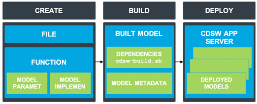

This lab will give you practice packaging a trained model into an immutable artifact and deploying models as REST APIs.

- Open Workbench and start a **Python 3** session using the 2 vCPU/ 4 GiB RAM engine.
- Open the file **7_fit.py** and run it. You will see the output generated through the screen that a .pkl file has been generated. On refreshing the available files (left top corner), you will see the code created a model called “petalWidthModel.pkl”.

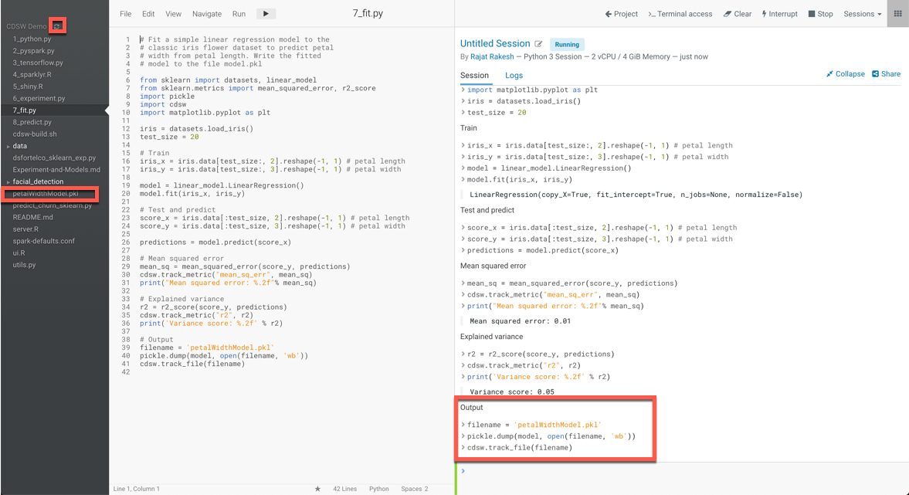

- Before we deploy thismodel, let’s test it in the workbench. Open file **8_predict.py** and run it. Then, to confirm that the predict() function works as expected, run this line of code by copying and pasting into
   the workbench prompt, see below screenshot: `predict({"petal_length": 19})`

   You should see the output like this:

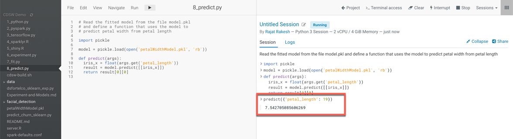

Now let’s deploy the add function to a REST endpoint.

- Stop your Python 3 Session used in step 3 above.
- Go to the project overview page and select **Models->New Model** from the left hand bar.
- Enter a name, description, select the python file **8_predict.py**, the **predict** function, and Example Input as per below screenshot: 

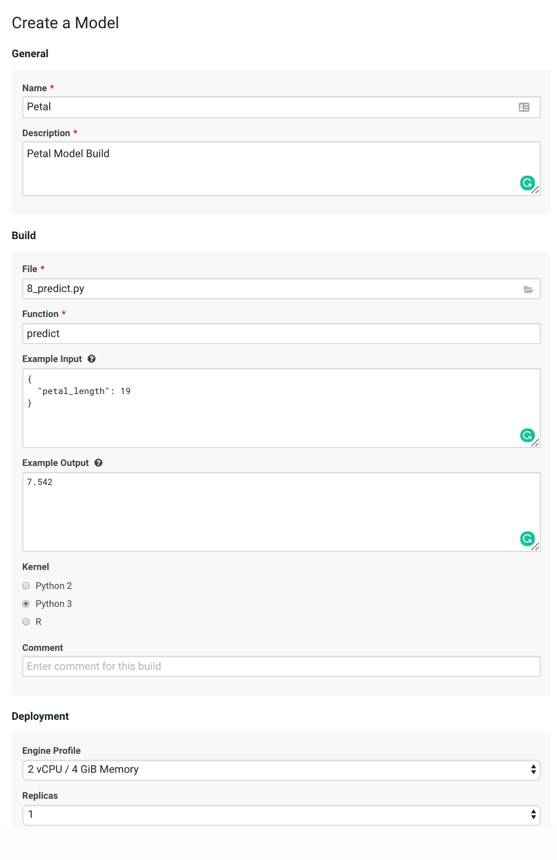

- Click on the model you just added and go to its **Build and Monitoring** pages to watch the build process until it completes.

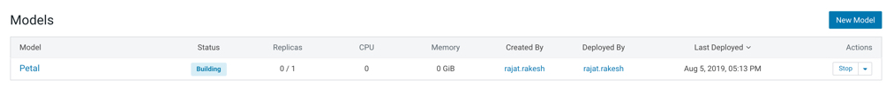

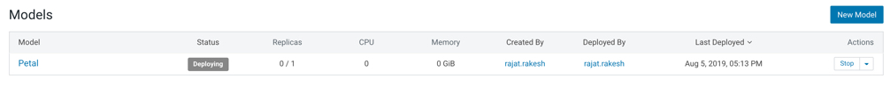

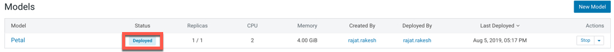

- Once the model has been built and **deployed**, go back to the model **Overview** page and use the **Test Model** widget to make sure the model works as expected.

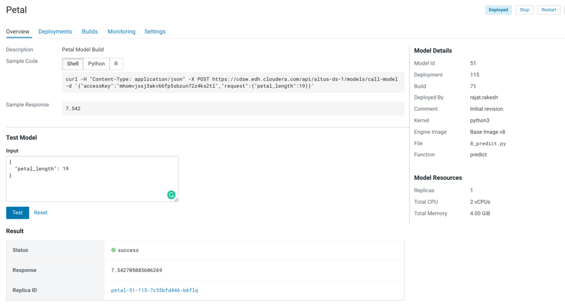

#### Model Administration

When a model
is deployed, Cloudera Data Science Workbench allows you to specify a number of replicas that will be deployed to serve requests. For each active model, you can monitor its replicas by going to the model's Monitoring page. On this page you can track the number of requests being served by each replica, success and failure rates, and their associated stderr and stdout logs. Depending on future resource requirements, you can increase or decrease the number of replicas by re-deploying the model.

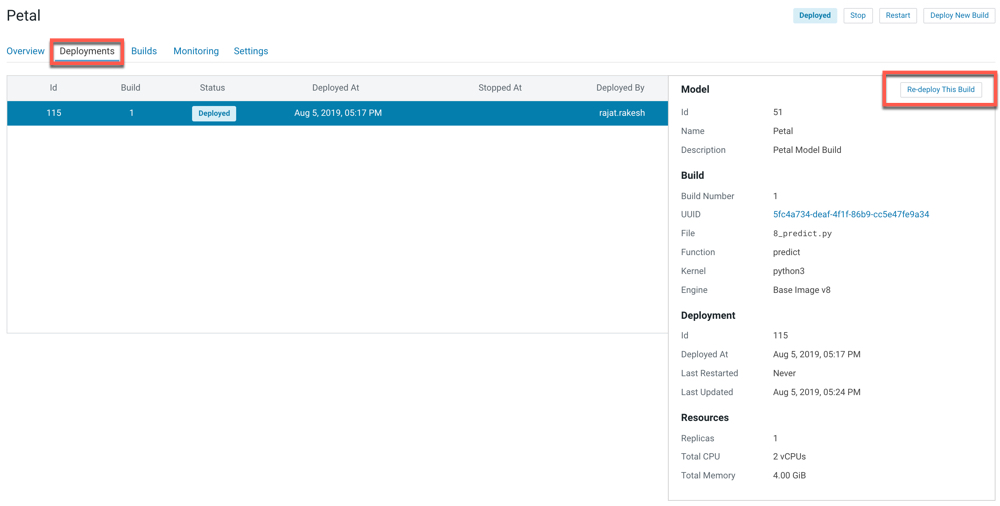

When you get to the re-deployment page, you can increase the number of replicas.

In order not to overload the cluster, hit the ‘Cancel’ button to return to the running model page. 

Now, navigate to the ‘Monitoring’ tab.

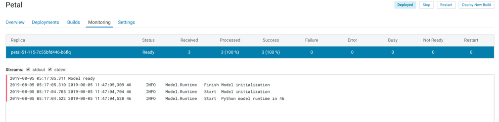

Several statistics of the model are displayed, like the number of times the model has been called, have been processed, etc.

 Logfile information is also available here. The most recent logs are at the top of the pane (see image). stderr logs are displayed next to a red bar while stdout logs are by a green bar. Note that model logs and statistics are only preserved so long as the individual replica is active. When a replica restarts (for example, in case of bad input) the logs also start with a clean slate.

Now, navigate to the ‘Settings’ tab.


On the settings
tab, you will be able to find the “Access Key” that is needed in order to call the model with a REST webservice call.

#### Accessing your Model

You can test using Shell, Python, and R to see the various ways the model can be accessed using a rest a REST interface.

If you execute the Shell option in terminal, then you will the following:

```
$ curl -H "Content-Type: application/json" -X POST https://cdsw.edh.cloudera.com/api/altus-ds-1/models/call-model -d '{"accessKey":"mhomvjssj3akv66fp5sbzun72z4ks2tl","request":{"petal_length":19}}'
{"success":true,"response":7.542705085606269}
```

Each model in Cloudera Data Science Workbench has a unique access key associated with it. This access key serves two purposes: 1) it is a unique identifier for the model, and 2) it serves as an authentication token that allows you to make calls to the model.

1. Note the access key used in the test examples. You would need this access key to use the Model from a REST API. Click on the Setting tab in your Model to see your key and the option for Regenerating a new Model Access Key.
2. Now try on  your own to see if you can figure out how to use the model from your environment.

The response shows that the model is still running and making predictions.

 That completes our lab with models. Please, free up some resources for other people and new projects. So stop your workbench session. And from the Models page, also stop your deployed model.

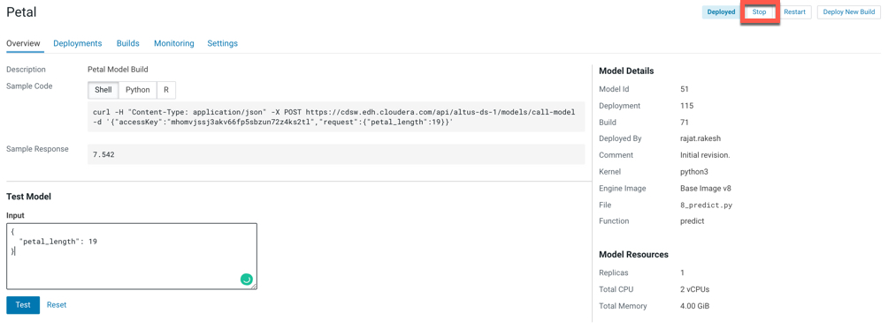

### End of Lab 9

------

[Back to Main](https://github.com/rajatrakesh/cdswlabs)