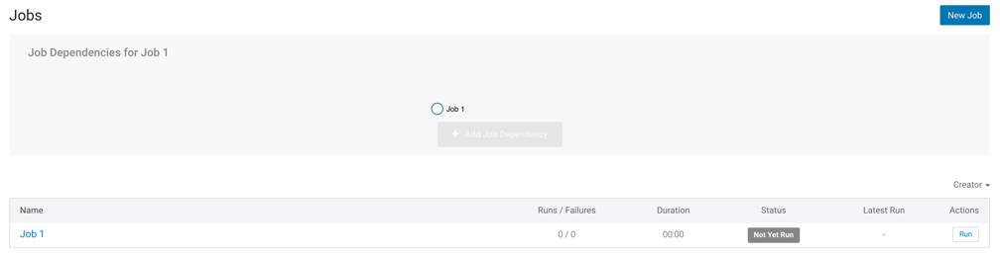
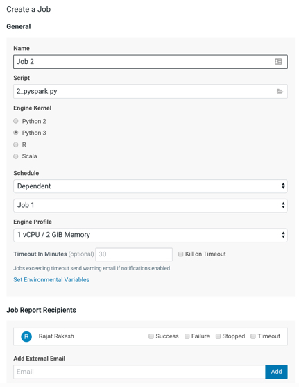
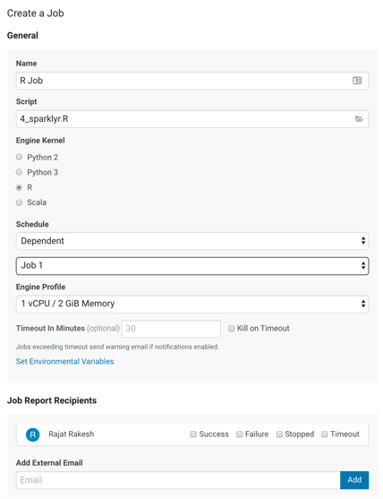
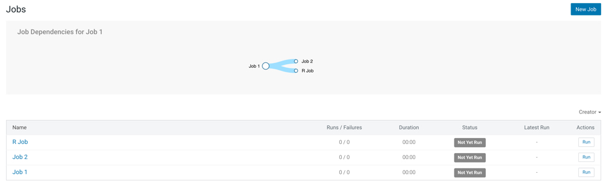
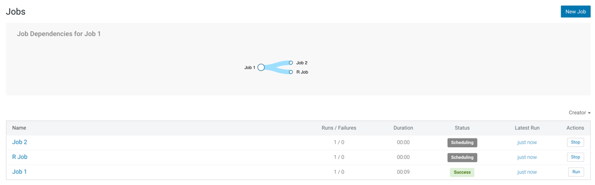

## Lab 10 : Scheduling Jobs

It’s often the case that you need to execute tasks on a periodic basis, and to execute one or more tasks once some other task has succeeded. Obviously there are sophisticated workflow engines many customers are already using. For simple workflows CDSW has a handy jobs system built in.  Jobs can also be exposed for for use from other scheduling systems.

 

This lab goes through the mechanics of creating a simple multi-step job process. 

- Open up your ‘**cdsw demo**’ project to get to this screen.

- You need to be in a project to create a Job.
- Select the ‘new job’ link in the middle of the page, and you’ll get to the following screen (there are other ways of getting to this next screen - its an exercise for the student to figure out what they might be):
- Create  a job that will be triggered manually and will execute the 1_python.py. Here are the parameters to do that.

| Name          | Job 1       |
| ------------- | ----------- |
| Script        | 1_python.py |
| Engine Kernel | Python 3    |

- Leave everything else as default. Scroll down and hit ‘Create Job’. You should get to this screen.

- Here you can see that you have a job (‘Job 1’). It’s never been run, and it has no dependencies.
- Let’s other jobs depend on this one: Click the ‘+ Add Job Dependency’ grayed out button and add a new job that has a dependency on ‘Job 1’. The parameters are:

| Name          | Job 2        |
| ------------- | ------------ |
| Script        | 2_pyspark.py |
| Engine Kernel | Python 2     |

1. Scroll down and ‘Create Job’. You’ll now see a page like this:

- So here we can see that ‘Job 2’ depends upon ‘Job 1’ (although you can run each manually, if you so choose). 

- Lets add another job that will run in parallel with Job 2:
- Click ‘New Job’ in the top right corner and create another job that depends upon ‘Job 1’. The parameters you’ll need are:

| Name          | R Job             |
| ------------- | ----------------- |
| Script        | 4_sparklyr.R      |
| Engine Kernel | R                 |
| Schedule      | Dependent / Job 1 |

- Create the job and you’ll see this.

- Lets run it all - hit the ‘Run’ button next to ‘Job 1’ (bottom of the list of jobs). You should see the job get scheduled, run, complete, and then the next two jobs should likewise get scheduled, run and complete.

  

  **Question**: How will a job scheduler reduce the effort required for you to build simple pipelines? 

  **Question**: What other facilities surrounding a job did we not explain? What do you think those other parameters might do?  

### End of Lab 10

------

[Back to Main](https://github.com/rajatrakesh/cdswlabs)